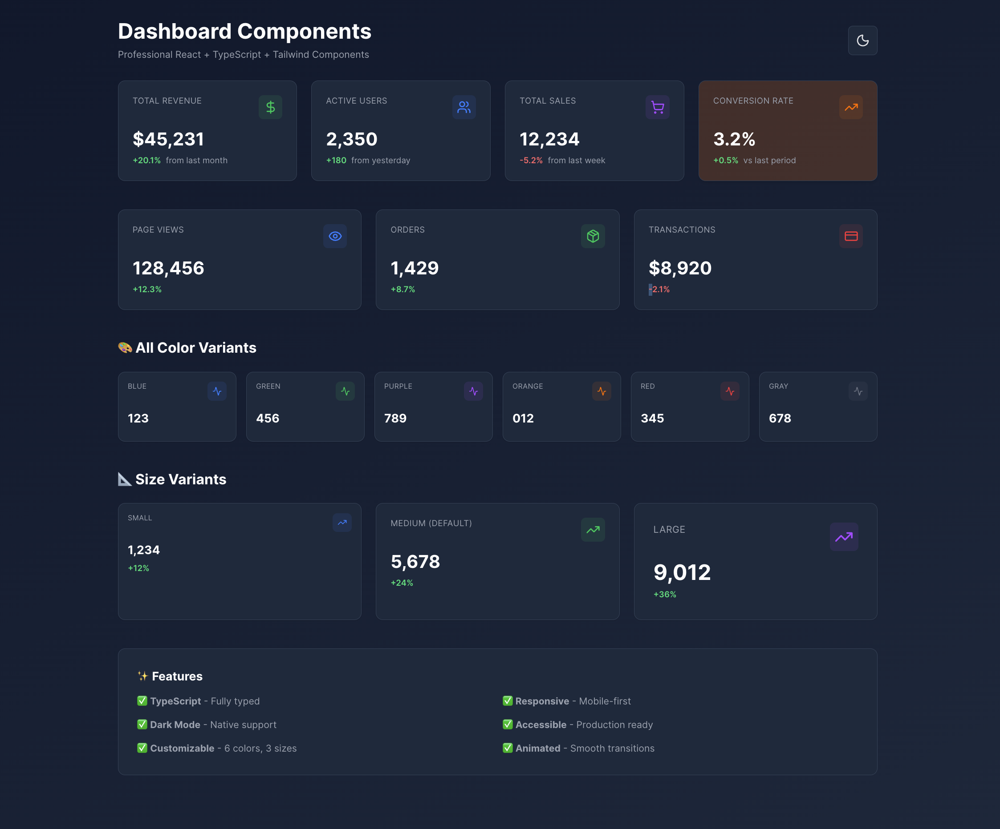
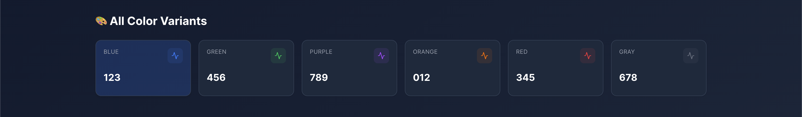
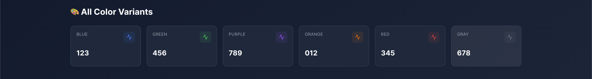
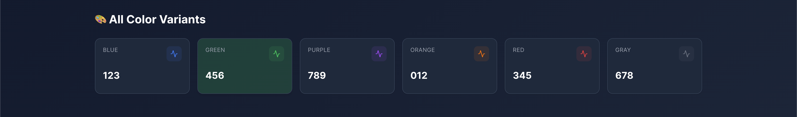
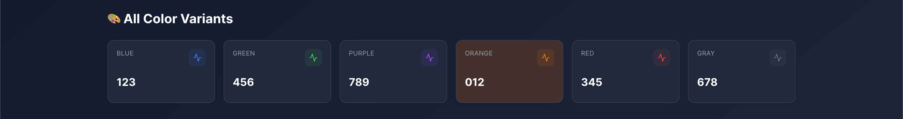
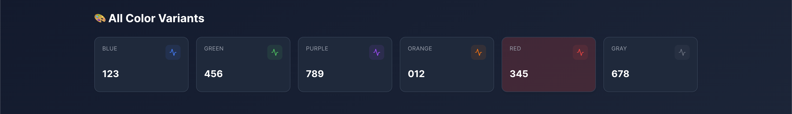
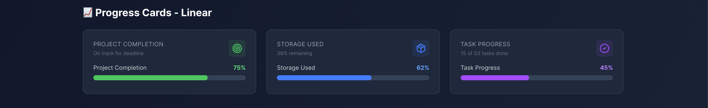
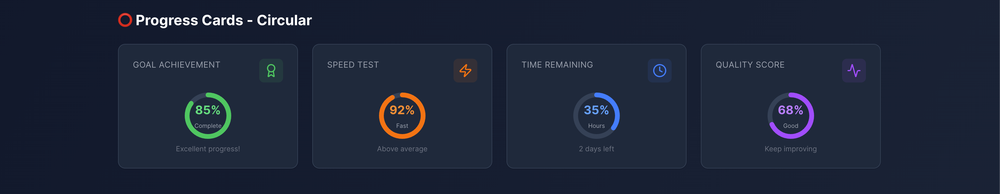
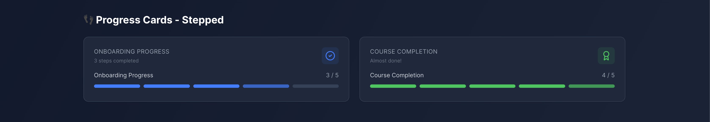
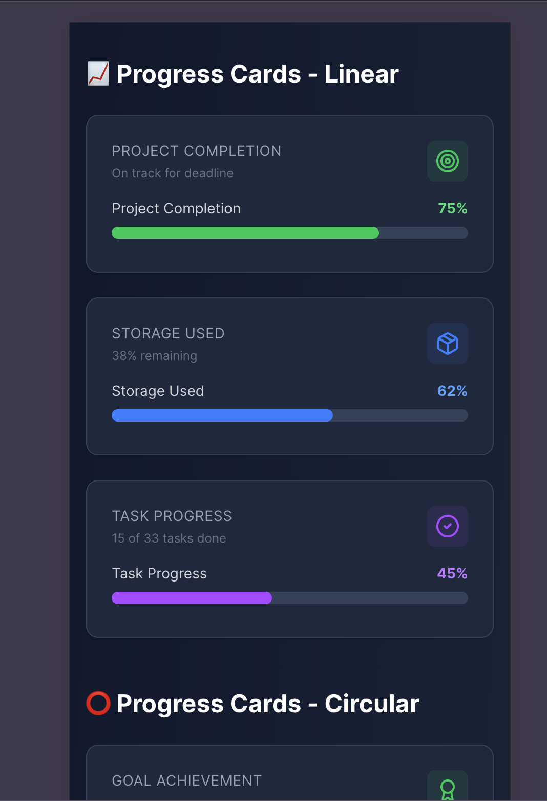

# 📊 Dashboard Components

> Professional, type-safe dashboard components for React + TypeScript

[](https://www.typescriptlang.org/)
[](https://reactjs.org/)
[](https://tailwindcss.com/)
[](LICENSE)



## ✨ Features

- 🎨 **Multiple Components** - Stats cards, Progress indicators, and more
- 📏 **Size Variants** - Small, Medium, Large options
- 🌓 **Dark Mode** - Built-in dark theme support
- 📱 **Responsive** - Mobile-first design
- ⚡ **TypeScript** - 100% type-safe
- 🎭 **Animated** - Smooth transitions
- ♿ **Accessible** - ARIA compliant

## 🚀 Quick Start
```bash
# Clone the repository
git clone https://github.com/YOUR-USERNAME/dashboard-components.git

# Install dependencies
npm install

# Start development server
npm run dev
```

## 📦 Components

### StatsCard

A versatile card component for displaying statistics and metrics.
```tsx
import { DollarSign } from 'lucide-react';
import { StatsCard } from './components/StatsCard';

<StatsCard
  title="Total Revenue"
  value="$45,231"
  change="+20.1%"
  changeType="positive"
  description="from last month"
  icon={DollarSign}
  variant="green"
/>
```

#### Props

| Prop | Type | Default | Description |
|------|------|---------|-------------|
| `title` | `string` | - | Card title (required) |
| `value` | `string \| number` | - | Main value to display (required) |
| `icon` | `LucideIcon` | - | Icon component |
| `change` | `string` | - | Change percentage |
| `changeType` | `'positive' \| 'negative' \| 'neutral'` | `'neutral'` | Change indicator color |
| `description` | `string` | - | Additional description |
| `variant` | `ColorVariant` | `'blue'` | Color variant |
| `size` | `'sm' \| 'md' \| 'lg'` | `'md'` | Card size |
| `animated` | `boolean` | `true` | Enable fade-in animation |
| `onClick` | `() => void` | - | Click handler |

## 🎨 Color Variants







Available colors: `blue`, `green`, `purple`, `orange`, `red`, `gray`

### 2. ProgressCard

A flexible progress indicator component with multiple visualization types.

```tsx
import { Target } from 'lucide-react';
import { ProgressCard } from './components/ProgressCard';


```

#### ProgressCard Props

| Prop | Type | Default | Description |
|------|------|---------|-------------|
| `title` | `string` | - | Card title (required) |
| `value` | `number` | - | Progress value 0-100 (required) |
| `icon` | `LucideIcon` | - | Icon component from lucide-react |
| `type` | `'linear' \| 'circular' \| 'stepped'` | `'linear'` | Progress visualization type |
| `label` | `string` | - | Label to show on progress |
| `description` | `string` | - | Additional description text |
| `variant` | `ColorVariant` | `'blue'` | Color variant |
| `size` | `'sm' \| 'md' \| 'lg'` | `'md'` | Card size |
| `showPercentage` | `boolean` | `true` | Show percentage value |
| `animated` | `boolean` | `true` | Enable animations |
| `totalSteps` | `number` | `5` | Total steps (for stepped type) |
| `currentStep` | `number` | `0` | Current step (for stepped type) |
| `footer` | `ReactNode` | - | Custom footer content |
| `onClick` | `() => void` | - | Click handler function |

#### Progress Types

**Linear Progress:**


```tsx

```

**Circular Progress:**


```tsx

```

**Stepped Progress:**

```tsx

```

## 🎨 Color Variants

Both components support 6 color variants:
- `blue` (default)
- `green`
- `purple`
- `orange`
- `red`
- `gray`

```tsx


```

## 📏 Size Variants

All components come in 3 sizes:
- `sm` - Small
- `md` - Medium (default)
- `lg` - Large

```tsx


```

## 🎯 Examples

### Dashboard Overview

```tsx


## 📱 Responsive Design



Works perfectly on all screen sizes.

## 🛠️ Tech Stack

- **React 18** - UI Library
- **TypeScript 5** - Type Safety
- **Tailwind CSS 3** - Styling
- **Vite 5** - Build Tool
- **Lucide React** - Icons

## 📝 Roadmap

- [x] StatsCard component
- [x] ProgressCard component (Linear, Circular, Stepped)
- [ ] ChartCard - Mini charts with Recharts
- [ ] TableCard - Sortable data tables
- [ ] ActivityCard - Activity feed timeline
- [ ] MetricCard - Advanced metric comparison
- [ ] Complete dashboard templates

## 🤝 Contributing

Contributions, issues and feature requests are welcome!

## 📄 License

MIT © ol3xi

## 🔗 Links

- [Live Demo](https://dashboard-components-lilac.vercel.app/)
- [Report Bug](https://github.com/Ol3xi/dashboard-components/issues)
- [Request Feature](https://github.com/Ol3xi/dashboard-components/issues)

---

**Built with ❤️ by ol3xi**

If you found this useful, please give it a ⭐️!